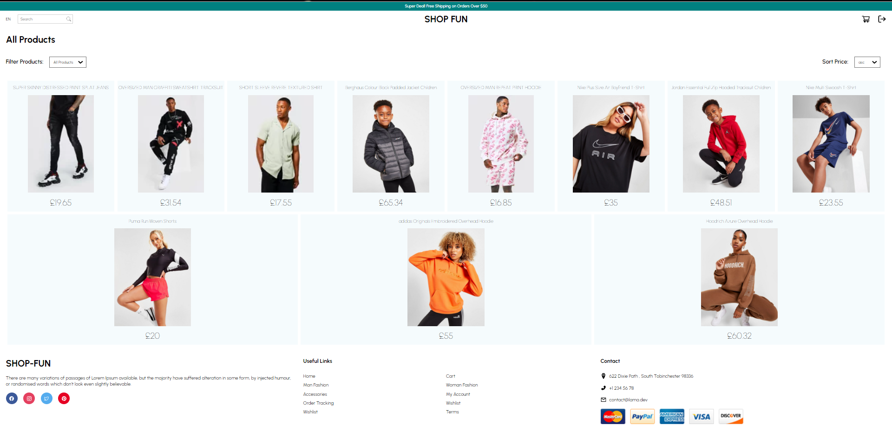
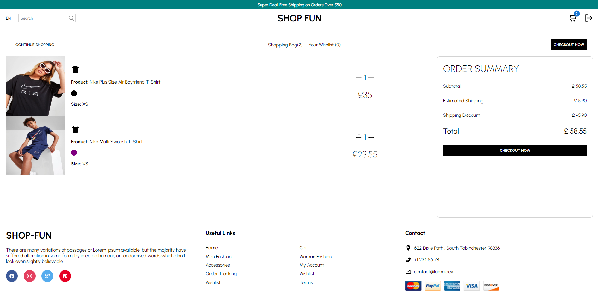

# SHOP FUN

Internet retail, also known as e-commerce, is the largest sector of the electronics industry, generating an estimated $29 trillion in 2019. E-commerce platforms like Shopify and WooCommerce provide a suite of services to businesses of all sizes. Due to their prevalence, understanding the fundamental architecture of these platforms will benefit you as a full-stack web developer. This project is a full stack e-commerce site, with the backend configured with a working Express.js API to use mongoose to interact with a mongodb database and stripe api for payment, with the client side being on react. The site is fully deployed on Heroku.

## HEROKU DEPLOYMENT

- CLIENT : https://shop-fun.herokuapp.com/
- SERVER : https://shop-fun-ecommerce-api.herokuapp.com/

## GITHUB

- CLIENT : https://github.com/DMO17/e-commerce-app-client
- SERVER : https://github.com/DMO17/e-commerce-app-server

## SHOP-FUN SITE SCREENSHOTS





## Installation

Run the following script to install the packages required for the application:

```


npm install @mui/material

npm install axios

npm install react-hook-form

npm install react-responsive

npm install react-icons

npm install react-router-dom

npm install react-stripe-checkout

npm install styled-components

```

## Scripts

Ensure that the package.json file has the following script:

```
git@github.com:DMO17/e-commerce-app-client.git

git@github.com:DMO17/e-commerce-app-server.git

```

## Usage

To use the application run the following script:

```
npm run start

```

## Tools/Technologies

- React
- styled-components
- JavaScript

## Contact

If you have any questions about this project or any other information please contact me through the following ;

1. Github: https://github.com/DMO17
2. Email: dmoha0123@gmail.com
3. Linkedin: https://www.linkedin.com/in/dahir-m-765a45218/
